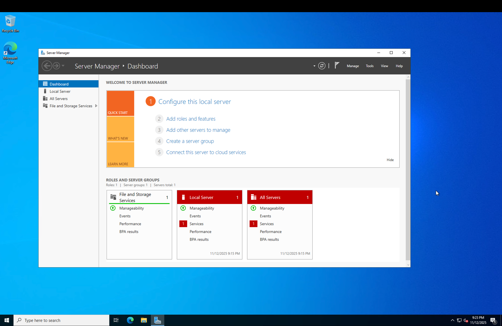
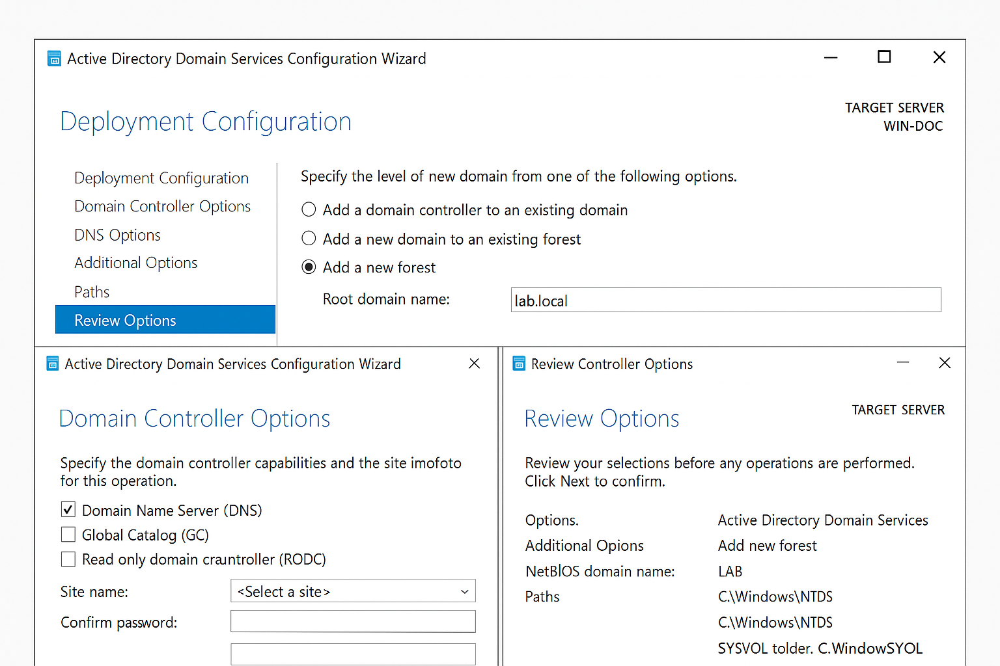
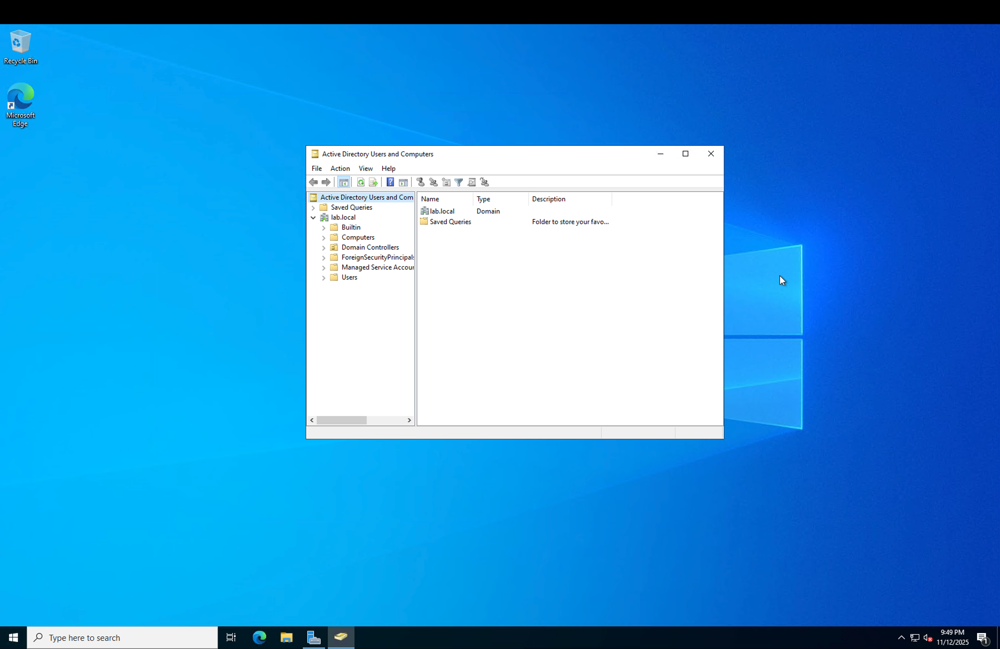

# 📘 **LAB 1 — Active Directory Domain Services (AD DS) Installation**

**Date:** *(add today’s date)*
**Skills Practiced:** Installing AD DS, creating a domain, promoting a Domain Controller
**Tools Used:** Windows Server 2022, Server Manager, Azure VM, RDP
**Difficulty:** Beginner

---

## 🎯 **Objective**

Install the Active Directory Domain Services (AD DS) role and create the **lab.local** domain on a Windows Server 2022 VM hosted in Azure.

---

## 🧰 **Prerequisites**

* Azure Windows Server 2022 VM
* RDP access using the `labuser` admin account
* Server Manager available

---

## 📝 **Steps Performed**

### **1. Opened Server Manager**

Server Manager was launched to begin configuring server roles and features.

**Screenshot:**



---

### **2. Installed Active Directory Domain Services (AD DS)**

Used **Add Roles and Features** to install the AD DS role.

**Path:**

```
Server Manager → Manage → Add Roles and Features → Active Directory Domain Services
```

**Screenshot:**


---

### **3. Promoted Server to Domain Controller**

Ran the AD DS Configuration Wizard:

* Selected **Add a new forest**
* Set **Root domain name:** `lab.local`
* Configured domain controller options
* Set DSRM password
* Allowed automatic reboot after installation

**Screenshot:**



---

### **4. Verified Domain Using ADUC**

Opened **Active Directory Users and Computers (ADUC)** to confirm:

* Domain = **lab.local**
* Default containers = Builtin, Computers, Domain Controllers, Users

**Screenshot:**



---

## ✅ **Results**

* The AD DS role was installed successfully
* The server was promoted to a Domain Controller
* The `lab.local` domain is fully functional
* Active Directory tools are now available

---

## 💡 **What I Learned**

* The purpose of AD DS
* How to install and configure AD DS
* What a forest and domain are
* How to verify a working Active Directory environment

---


