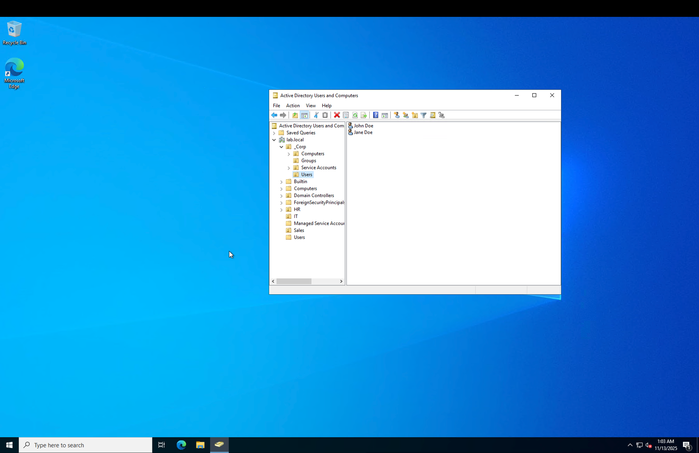
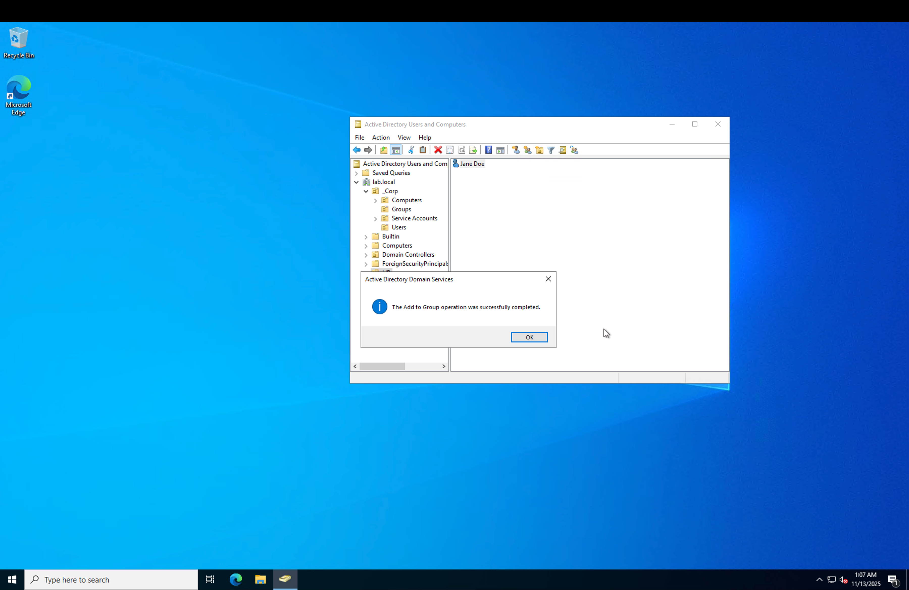
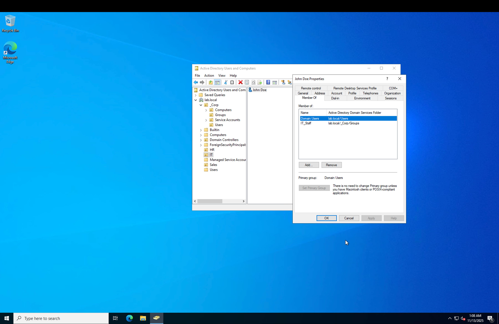

# 🟦 Lab 2 — Active Directory User & Group Management
This lab demonstrates foundational ADUC skills: creating users, organizing them into department OUs, and assigning them to security groups.

## 📌 Objective
- Create standard user accounts  
- Move users into appropriate department OUs  
- Assign users to department security groups  
- Verify proper role-based access control (RBAC)

## 🛠 Prerequisites
- Windows Server promoted to Domain Controller  
- Active Directory Domain Services installed  
- Access to Active Directory Users and Computers (ADUC)  
- Existing structure:  
  - _Corp (Groups, Service Accounts, Users)  
  - HR, IT, Sales OUs  
  - HR_Staff, IT_Staff, Sales_Staff security groups  

# ✅ STEP 1 — Create User Accounts
Create two standard users inside the _Corp → Users OU.

### User 1: John Doe
- First Name: John  
- Last Name: Doe  
- Username: john.doe  
- Set a password  
- Uncheck: User must change password at next logon

### User 2: Jane Doe
- First Name: Jane  
- Last Name: Doe  
- Username: jane.doe  
- Set a password  
- Uncheck: User must change password at next logon

### 📸 Screenshot  


# ✅ STEP 2 — Move Users Into Their Department OUs
Drag and drop:
- John Doe → IT OU  
- Jane Doe → HR OU  

### 📸 Screenshots  
  


# ✅ STEP 3 — Add Users to Department Security Groups

### Add John Doe → IT_Staff
```
Right-click John Doe → Add to a group → IT_Staff → OK
```

### 📸 Screenshot  


### Add Jane Doe → HR_Staff
```
Right-click Jane Doe → Add to a group → HR_Staff → OK
```

### 📸 Screenshot  


# ✅ STEP 4 — Verify Group Membership

### For John Doe:
1. Double-click John Doe  
2. Open Member Of tab  
3. Confirm:  
   - Domain Users  
   - IT_Staff  

### 📸 Screenshot  


### For Jane Doe:
1. Double-click Jane Doe  
2. Open Member Of tab  
3. Confirm:  
   - Domain Users  
   - HR_Staff  

### 📸 Screenshot  


# 🎉 Lab 2 Completed
You successfully demonstrated:
- Adding users to AD  
- Organizing users into OUs  
- Applying department-based security groups  
- Verifying membership through Member Of  

These are core skills for help desk, junior sysadmins, and SOC analysts.
