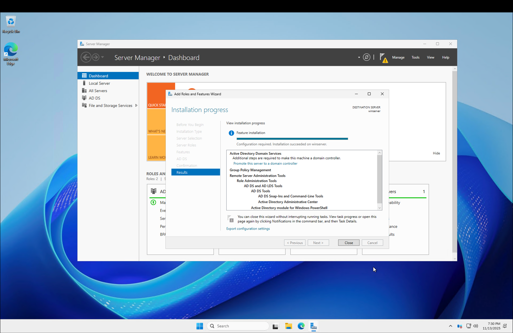
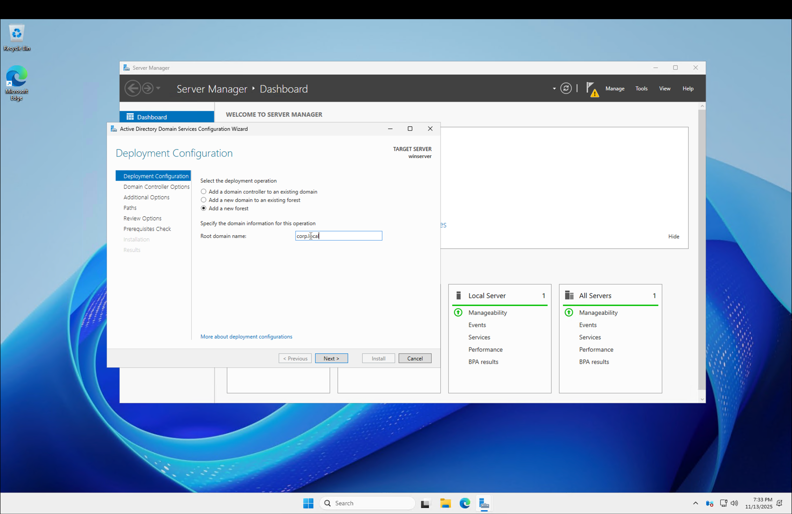
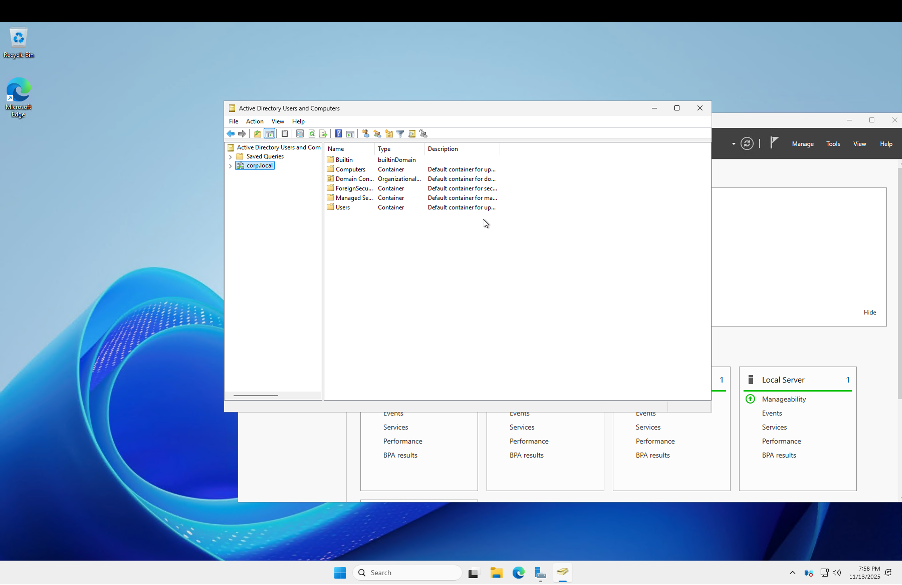
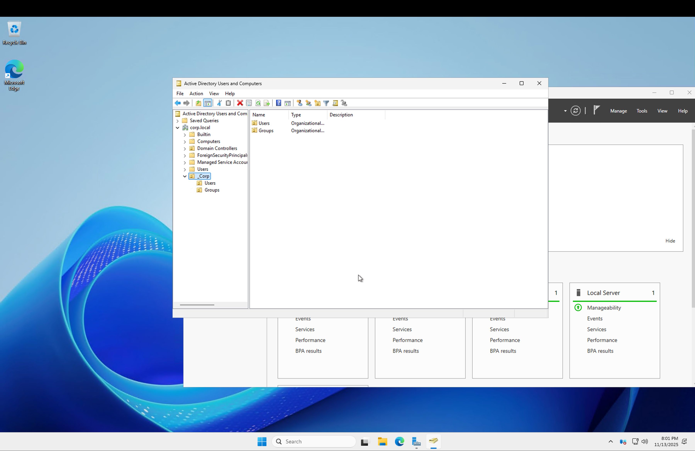
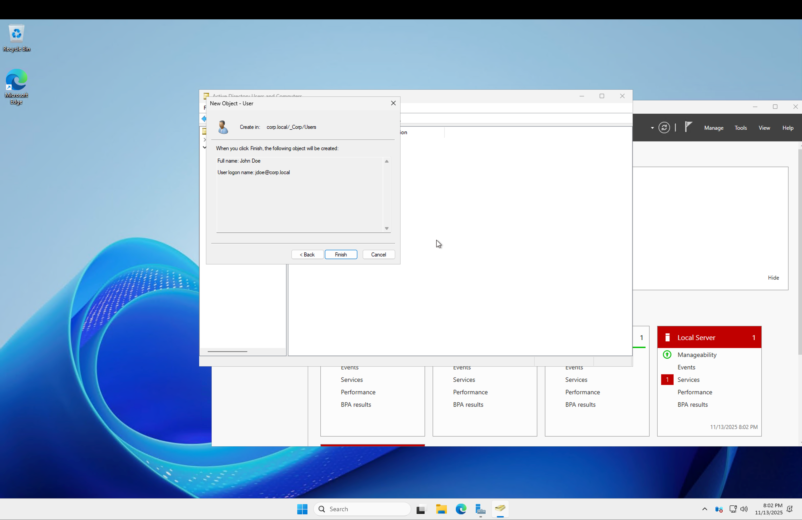
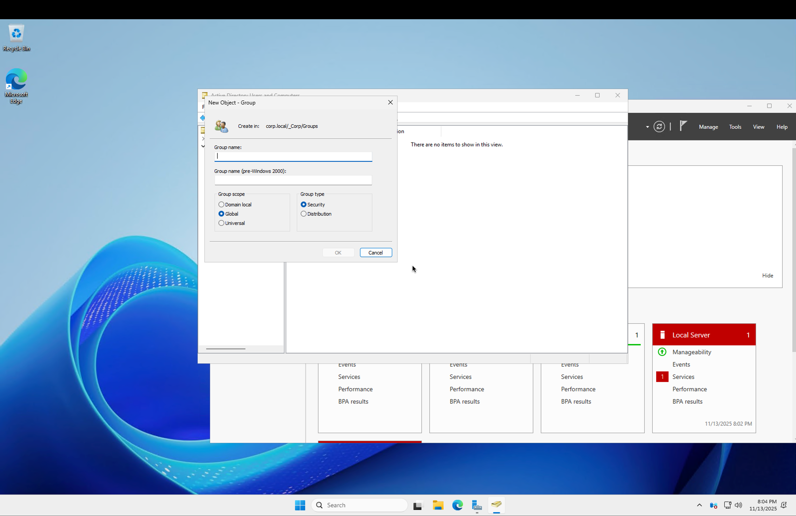
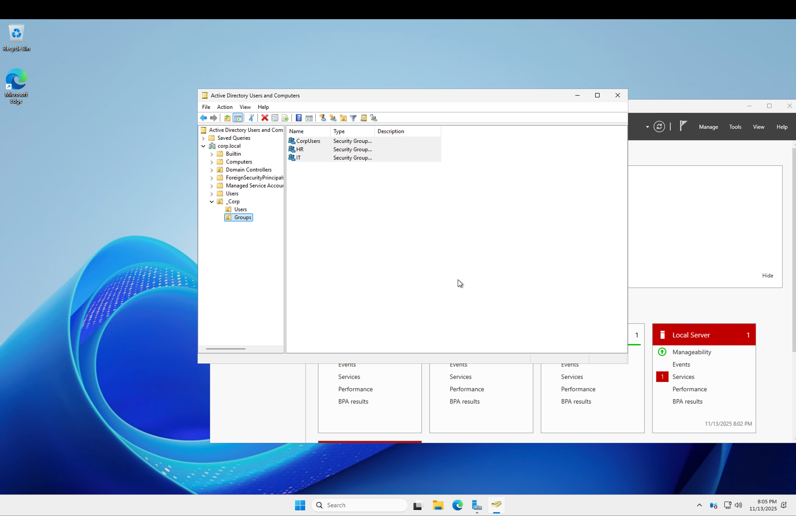
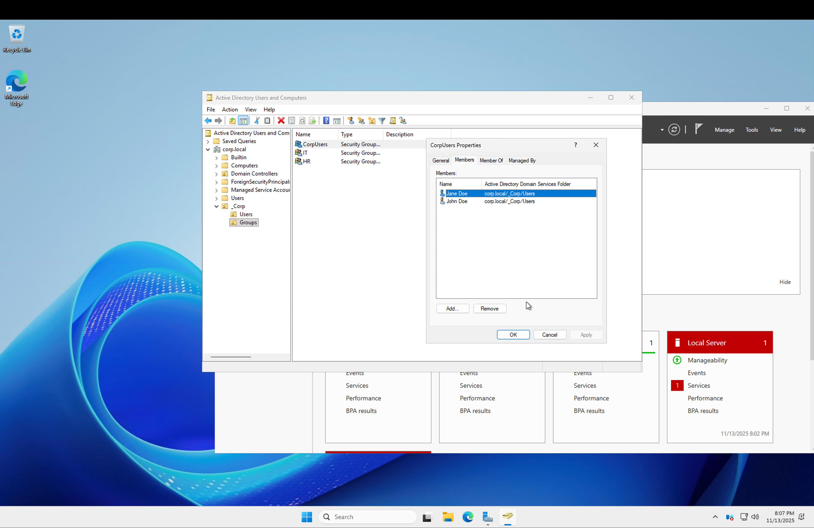

# 🧪 Lab 3: OU, User, and Group Management in Active Directory

## 🔎 Overview
This lab demonstrates how to create a clean organizational structure inside Active Directory using Organizational Units (OUs), users, and security groups. This mirrors real help desk + sysadmin tasks such as user provisioning, onboarding, and permission management.

---

# 🏗️ **Step-by-Step Process**

## **Step 1 — Open Active Directory Users and Computers (ADUC)**  
- After promoting the server to a Domain Controller, open **ADUC** from:  
  **Server Manager → Tools → Active Directory Users and Computers**
 

---

## **Step 2 — Create the Root OU (_Corp)**  
- Right‑click the domain `corp.local` → **New → Organizational Unit**  
- Name it: **_Corp**  
- This creates a clean container for all company resources.
 

---

## **Step 3 — Create Sub-OUs (Users & Groups)**  
Inside `_Corp`, create two OUs:

- **Users**  
- **Groups**

This separation follows Microsoft best practices and keeps objects organized.
 

---

## **Step 4 — Create Domain Users (John Doe & Jane Doe)**  
Inside `_Corp > Users`:

Create two users:

### **User 1**
- Name: **John Doe**
- Username: **jdoe**
- Domain login: `jdoe@corp.local`

### **User 2**
- Name: **Jane Doe**
- Username: **jadoe**
- Domain login: `jadoe@corp.local`

---

## **Step 5 — Create Security Groups (HR, Accounting)**  
Inside `_Corp > Groups`:

Create two **Security Groups**:
- **HR**
- **Accounting**

(Use **Global** scope and **Security** type — default and correct for domain users)
 
  

---

## **Step 6 — Add Users to Groups**  
This simulates real‑world permission assignment.

- Add **jdoe** → **HR**  
- Add **jadoe** → **Accounting**

  

---

## **Step 7 — (Optional) View Default Domain Password Policy**  
Navigate to:

**Group Policy Management → Default Domain Policy →  
Computer Configuration → Policies → Windows Settings → Security Settings → Account Policies → Password Policy**

This shows default requirements (password length, history, age, etc.)

---

# ✅ Completion Checklist

| Task                           | Status |
|-------------------------------|--------|
| AD DS Installed               | ✅ |
| Domain Promoted (`corp.local`) | ✅ |
| ADUC Launched                 | ✅ |
| `_Corp` OU Created            | ✅ |
| Users & Groups OUs Created    | ✅ |
| John Doe Created              | ✅ |
| Jane Doe Created              | ✅ |
| HR & Accounting Groups Created | ✅ |
| Users Added to Groups         | ✅ |
| Password Policy Viewed        | ✅ (optional) |
| Screenshots Uploaded          | ✅ |

---

---

# 🧠 What You Learned
- How to structure Active Directory using OUs  
- How to create domain users and groups  
- How to assign users to security groups (permissions model)  
- Where password policies are managed (Group Policy)  
- Core skills used daily by Help Desk, Desktop Support, and Sysadmins  

---

